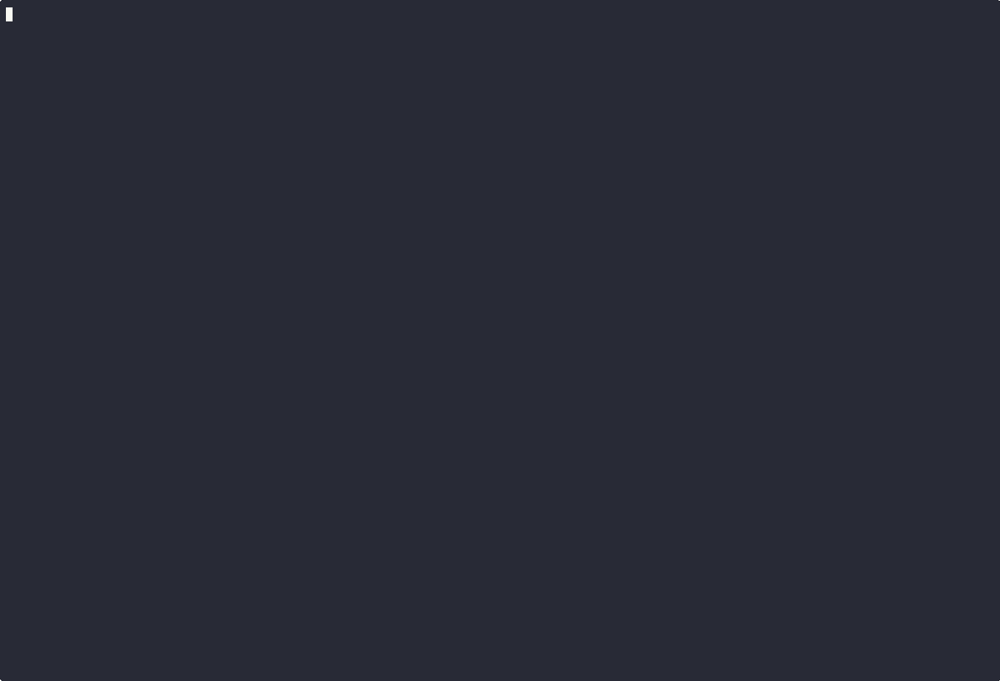

# tesht — Table-Driven Testing for Bash


A lightweight testing framework for Bash scripts inspired by Go’s testing package. Write
clean, maintainable table-driven tests for your shell functions with automatic test
discovery and clear failure reporting.



## Why Test Bash?

- Bash code is infrastructure and needs to be reliable
- Prevent regressions when refactoring shell scripts
- Verify intended behavior regardless of experience level
- Explore and learn bash with confidence

## Features

- **Automatic discovery** of `*_test.bash` files and `test_*` functions
- **Table-driven testing** with reusable test logic across multiple cases
- **Test isolation** - each test runs in its own subshell
- **Clear output** - detailed pass/fail status with timing and colored results
- **Helpful assertions** with diff output and suggested fixes
- **Built-in utilities** for HTTP servers, temp directories, and common test needs

## Quick Start

1.  **Install tesht**:

    ``` bash
    cp tesht /usr/local/bin/
    # or
    ln -s "$PWD/tesht" ~/bin/
    ```

2.  **Make your script testable** by adding this line after your functions:

    ``` bash
    return 2>/dev/null  # allows sourcing without execution
    ```

3.  **Write a test file** (e.g., `myScript_test.bash`):

    ``` bash
    #!/usr/bin/env bash
    source ./myScript || exit 1

    test_MyFunction() {
        local -A case1=(
            [name]='basic functionality'
            [input]='test input'
            [want]='expected output'
        )

        local -A case2=(
            [name]='edge case'
            [input]='edge input'
            [want]='edge output'
        )

        subtest() {
            local casename=$1
            eval "$(tesht.Inherit $casename)"

            local got
            got=$(MyFunction "$input")

            tesht.AssertGot "$got" "$want"
        }

        tesht.Run ${!case@}
    }
    ```

4.  **Run tests**:

    ``` bash
    tesht                              # run all tests in *_test.bash files
    tesht myScript_test.bash           # run tests from a specific file
    tesht foo_test.bash bar_test.bash  # multiple files
    tesht scripts/                     # all *_test.bash in scripts/ (shallow)
    tesht -run TestMyFunction          # filter test names by regex
    tesht myScript_test.bash -run TestFoo  # file + name filter
    ```

    Positional args are test files or directories; `-run REGEXP` filters by name (bash native regex). Directories expand to `*_test.bash` one level deep (shallow). Matches Go's `go test [-run regexp] [files]` shape.

## Writing Tests

### Basic Test Structure

Tests are functions named `test_*` that tesht discovers automatically:

``` bash
test_BasicFunction() {
    ## arrange
    local input="test data"
    local expected="expected result"
    
    ## act
    local result
    result=$(MyFunction "$input")
    
    ## assert
    tesht.AssertGot "$result" "$expected"
}
```

### Table-Driven Tests

For multiple test cases sharing the same logic:

``` bash
test_CalculatorTable() {
    local -A case1=([name]='addition' [a]=2 [b]=3 [op]='+' [want]=5)
    local -A case2=([name]='subtraction' [a]=5 [b]=2 [op]='-' [want]=3)
    local -A case3=([name]='multiplication' [a]=4 [b]=3 [op]='*' [want]=12)

    subtest() {
        local casename=$1
        eval "$(tesht.Inherit $casename)"
        
        local got
        got=$(Calculator "$a" "$op" "$b")
        
        tesht.AssertGot "$got" "$want"
    }

    tesht.Run ${!case@}
}
```

### Testing Return Codes

``` bash
test_ErrorHandling() {
    local got rc
    got=$(SomeFunction "invalid input") && rc=$? || rc=$?
    
    tesht.Softly <<'END'
        tesht.AssertRC $rc 1
        tesht.AssertGot "$got" "Error: invalid input"
END
}
```

### Smoke Testing CLIs

For ad-hoc CLI smoke checks outside test functions — e.g. verifying
a binary's validation paths after a build — naive shell chains
propagate the *last* command's exit code as the script's. A script
ending with an intentional-failure probe (a command that's *supposed*
to exit nonzero) reports an overall nonzero exit, even though the
probe behaved exactly as designed. `tesht.Smoke` inverts that: it
runs a command and succeeds iff the command's exit code matches the
expected value.

``` bash
# After building, verify the CLI's validation paths.
tesht.Smoke 1 mytool --required        # missing required arg → expect rc=1
tesht.Smoke 1 mytool --bad-flag        # unknown flag → expect rc=1
tesht.Smoke 0 mytool --version         # success path → expect rc=0
echo 'all smoke checks passed'
```

Each call returns 0 if the command's actual rc matches the expected;
nonzero otherwise (with the actual rc and captured output reported on
stderr via `tesht.Log`). The script's overall exit code now reflects
*unexpected* failures only.

The optional `--` separator can disambiguate when the command starts
with a flag-like token: `tesht.Smoke 1 -- mytool --help`.

### Mocking Commands

``` bash
test_WithMockedCommand() {
    # Mock external command
    curl() {
        echo "mocked response"
        return 0
    }
    
    local result
    result=$(FunctionThatUsesCurl)
    
    tesht.AssertGot "$result" "processed: mocked response"
}
```

## API Reference

### Core Functions

- **`tesht.Run ${!case@}`** - Execute table-driven subtests
- **`tesht.Inherit $casename`** - Load associative array into local variables
- **`tesht.AssertGot actual expected`** - Compare strings with diff on failure
- **`tesht.AssertRC actual expected`** - Compare return codes
- **`tesht.Smoke expected_rc [--] cmd [args...]`** - Run a CLI smoke check; succeed iff actual rc matches expected
- **`tesht.Softly`** - Run multiple assertions, continue on failure
- **`tesht.Log message...`** - Print message from test

### Utilities

- **`tesht.MktempDir`** - Create temporary directory (auto-cleanup)
- **`tesht.StartHttpServer [port]`** - Start HTTP server for testing
- **`tesht.Diff expected actual`** - Show unified diff

## Usage

``` bash
tesht [-x] [-f file1,file2,...] [test_name...]
```

- **No arguments**: Runs all `test_*` functions in all `*_test.bash` files
- **With test names**: Runs only the specified tests and their subtests
- **`-f` flag**: Constrain execution to specific test files (comma-separated)
- **`-x` flag**: Enable trace output for debugging test discovery and execution

## Example Output

    === RUN         test_Calculator/addition
    --- PASS    2ms test_Calculator/addition
    === RUN         test_Calculator/subtraction  
    --- PASS    1ms test_Calculator/subtraction
    === RUN         test_Calculator/division by zero

    got does not match want:
    < Error: division by zero
    ---
    > Expected error message

    use this line to update want to match:
        want='Error: division by zero'

    --- FAIL    3ms test_Calculator/division by zero
    FAIL        6ms
    1/3

## Test Isolation

Each test function runs inside a subshell (`( ... )`), forked from the
runner. This gives strong process-level isolation between tests.

**Cannot leak between tests:**

- Variable changes (`local`, `export`, plain assignments)
- Working directory (`cd`)
- Shell options (`set -e`, `set -o noglob`, ...)
- Function redefinitions, sourced files
- `EXIT` / `ERR` / signal traps

**Cannot affect the parent test runner:**

- `exec` replaces only the subshell's process; the runner is the parent
  and is unaffected
- `exit` terminates only the subshell; the runner records the rc and
  continues
- Resource limits (`ulimit`) apply only inside the subshell

**Can leak — use the cleanup helpers:**

- Filesystem changes outside a temp dir → use `tesht.MktempDir`
- Background child processes → register cleanup with `tesht.Defer` (or a
  `trap "kill $pid" EXIT` for single-test scripts)
- External state (network listeners, shared databases, system files)

**Genuinely shared:**

- The terminal `stdout`/`stderr` (the runner serializes test output)
- Resources reachable through `kill $PPID` or `/proc/$PPID/...` —
  isolation only protects against ordinary test misbehavior, not
  deliberate sabotage

The practical guarantee: write each test assuming a clean process state
(it gets one), but treat the filesystem and external resources as shared
and clean them up explicitly.

## Best Practices

1.  **Test file naming**: Use `*_test.bash` suffix matching the script name
2.  **Test function naming**: Prefix with `test_` for auto-discovery
3.  **Case naming**: Use descriptive names that explain what’s being tested
4.  **Arrange-Act-Assert**: Structure tests with clear sections
5.  **Edge cases**: Test boundary conditions and error scenarios
6.  **Isolation**: Don’t rely on test execution order
7.  **Cleanup**: Use temp directories and trap for resource cleanup

## Real-World Example

``` bash
# test_HttpClient tests HTTP request functionality
test_HttpClient() {
    ## arrange
    local dir
    dir=$(tesht.MktempDir) || return 128
    cd "$dir"
    
    echo "test content" > index.html
    
    local pid
    pid=$(tesht.StartHttpServer 8080) || return 128
    trap "kill $pid" EXIT
    
    ## act
    local response rc
    response=$(HttpGet "http://localhost:8080/index.html") && rc=$? || rc=$?
    
    ## assert
    tesht.Softly <<'END'
        tesht.AssertRC $rc 0
        tesht.AssertGot "$response" "test content"
END
}
```

## License

MIT License
